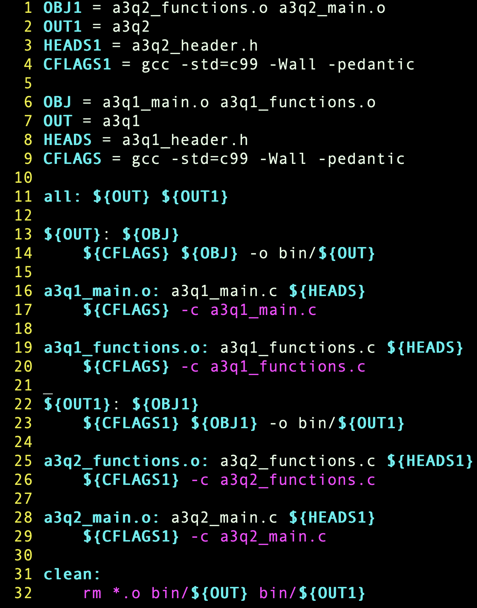

# Makefile Generator
CLI tool written in Rust to generate makefiles for compiling programs.

This tool is ***unfinished*** but is fully functional in creating makefiles for C and C++ programs.

Current Goals:
* Avoid creating duplicate source file compilations
* Learn more about Rust file handling and refactor the code
* Refactor loops in the main function
* Allow for some other languages to be used (asm, rust, etc.)

## Setup
### Project Folder
Open your computer's terminal and cd to a directory of your choice.

Ensure [git](https://git-scm.com/) is installed on your system, then clone this repository using:

```sh
git clone https://github.com/Cortes205/MakefileGenerator
```

or you can download it manually as a zipfile.

## Usage
### Execute
Open the terminal in the program's directory

Ensure you have the following:
* [rustc](https://www.rust-lang.org/tools/install) (Rust compiler)
* A folder named 'bin'

To compile this program, use the following command:

```sh
rustc src/main.rs -o bin/makegen 
```

Next, change into the bin directory and input the command:
```sh
pwd
```
To display the full directory. Copy this directory!

In order to access this tool from anywhere in your terminal, you will need to add the directory you copied to the command path.

#### On MacOS
Input the command:
```sh
echo '<the directory>' | sudo tee -a /etc/paths
```
You will need to enter your computer's password. Afterward, restart your terminal.

Now you can use this tool anywhere!

For the help menu use the command:
```sh
makegen -h
```

Otherwise, to make use of the tool, use the command:
```sh
makegen -c <target filename> <source files> <header files> -<flags>
```

If you'd like to create multiple targets, use the '-new' command then follow the same argument format. Example:
```sh
makegen -c <target filename> <source files> <header files> -<flags> -new -c <second target> <source files> <header files> -<flags>
```

The order of arguments only matters for the first two.

* -c indicates you are going to be compiling a C program (another option is -cpp for C++)
* The target file must be the second argument (it will automatically be put into a folder named bin)
* Source files, header files, and compiler flags can be ordered in any way, but they follow a few rules:

1. At least one source file must be provided
2. Source files that do not match the given language code or non .h files will cause the tool to halt
3. Any compiler flags must have a preceding '-' (much like actual compilation)
4. Using the flag "-default" will use predertemined flags depending on the language (see 'makegen -h' for more info)

Compilation flags will not be checked by the tool, but you will evidently receive an error when trying to run the makefile!

### Demonstrations
Both of these demonstrations are being done with my old C assignments.

**Note**: These demonstrations were done without the tool in the command path; this is why I used './makegen' as opposed to just 'makegen'
#### An example of using this tool in a project directory for one target:
Assume we have the following in our directory:


Now we can use the makegen tool:

We specify that we are going to compile a C program (-c) and have decided to name 
the target file a4. Next (not in any specific order) we input our .c files, .h files, and compiler flags (-default
being -std=c99 -Wall -pedantic)

Next we can see our makefile has been created:


We can then check to see that it works and compiles our program:


#### An example of using this tool in any of your project directories for two targets:
Assume we have the following in our directory:


Now we can use the makegen tool:

We specify that we are going to compile a C program (-c) and have decided to name 
the target file a3q1. Next (again, not in any specific order) we input our .c files, .h files, and compiler flags (-default
being -std=c99 -Wall -pedantic). But, we still need to create an executable for question 2 of this assignment! Therefore,
we use the '-new' command to specify we are creating another target. Once again we specify that it is a 
C program, name the executable a3q2, input our compiler flags, and input our necessary files.

Next we can see our makefile has been created:


We can then check to see that it works and compiles our programs:


***NOTE***
* Creating more than 2 targets follows the same procedures ('-new' then necessary arguments)
* If any of your target files have errors your makefile will not be created, and you will be told
which target has an error


* If you do not specify compiler flags (for any targets) they will be left blank

### Runtime
There is nothing to be input during runtime! 

The only thing that happens (in the best case) is a file called makefile will be outputted and will be ready for use.

In the worst case, you will be told that there is an error in your arguments

## About This Project
This project was a way for me to learn the Rust programming langauge while solving a personal problem of mine. The majority of my programming classes in school are done in C and I hate writing makefiles for the 10+ source files I have to create. I mean, who doesn't? Yes, there are online tools that already generate makefiles, but there's no learning in that, so they're not fun! With this mini-project, I am learning yet another embedded systems language, how to code in vim, more about git, what makes a good CLI tool, and the command path on Mac. The learning never stops!

[LinkedIn](https://www.linkedin.com/in/cortes205/)
